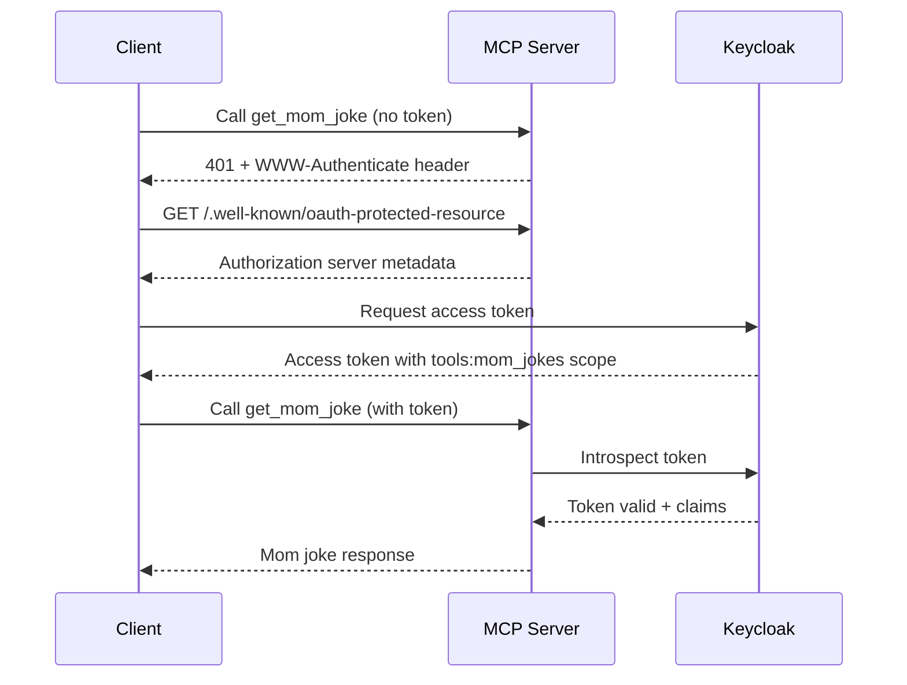

# Joke MCP Server

A [Model Context Protocol (MCP)](https://modelcontextprotocol.io/) server that provides dad and mom joke generation tools.

## Features

- 🎭 **Two Joke Tools**: Get random dad jokes or mom jokes on demand
- 🔌 **Multiple Transports**: Supports both stdio and HTTP/SSE transports
- 🔐 **OAuth 2.1 Authorization**: Selective tool protection with RFC 9728 compliance
- ✅ **Type Safe**: Fully typed Python code with comprehensive type hints
- 🧪 **Well Tested**: Comprehensive test coverage for core functionality
- 📦 **Modern Stack**: Built with uv, FastAPI, and the official MCP SDK

## Installation

### Prerequisites

- Python 3.10 or higher
- [uv](https://docs.astral.sh/uv/) package manager

### Setup

1. Clone the repository:
```bash
git clone <repository-url>
cd mcp
```

2. Install dependencies:
```bash
uv sync
```

3. Run tests to verify installation:
```bash
uv run pytest
```

## Usage

### Stdio Transport (Default)

The stdio transport is ideal for local integrations and MCP-compatible applications.

#### Start the server:
```bash
uv run joke-server
```

#### Test with MCP Inspector:
```bash
npx @modelcontextprotocol/inspector uv --directory /Users/jwinter/projects/mcp run joke-server
```

#### Configure in MCP Client:

Add to your MCP client configuration (e.g., `~/.config/claude/config.json`):

```json
{
  "mcpServers": {
    "joke-server": {
      "command": "uv",
      "args": [
        "--directory",
        "/Users/jwinter/projects/mcp",
        "run",
        "joke-server"
      ]
    }
  }
}
```

### HTTP Transport

The HTTP transport provides a REST API with Server-Sent Events (SSE) for streaming.

#### Start the HTTP server:
```bash
uv run python -m joke_mcp_server.http_server
```

The server will start on `http://127.0.0.1:8000` by default.

#### Available Endpoints:

- `GET /` - Server information
- `GET /health` - Health check
- `POST /mcp` - Main MCP protocol endpoint (Streamable HTTP)

#### Test the HTTP server:
```bash
# Get server info
curl http://127.0.0.1:8000/

# Health check
curl http://127.0.0.1:8000/health

# List tools
curl -X POST http://127.0.0.1:8000/mcp \
  -H "Content-Type: application/json" \
  -d '{
    "jsonrpc": "2.0",
    "id": 1,
    "method": "tools/list",
    "params": {}
  }'

# Get a dad joke
curl -X POST http://127.0.0.1:8000/mcp \
  -H "Content-Type: application/json" \
  -d '{
    "jsonrpc": "2.0",
    "id": 2,
    "method": "tools/call",
    "params": {
      "name": "get_dad_joke",
      "arguments": {}
    }
  }'
```

## OAuth 2.1 Authorization

The MCP Joke Server implements OAuth 2.1 authorization following RFC 9728 (Protected Resource Metadata). This allows selective protection of tools - dad jokes are public, while mom jokes require authentication.

### Quick Start with OAuth

1. **Start Keycloak and PostgreSQL:**
```bash
docker-compose up -d
```

2. **Configure Keycloak automatically:**
```bash
python scripts/configure-keycloak.py
```

3. **Start the server with OAuth enabled:**
```bash
export KEYCLOAK_URL=http://localhost:8080
export KEYCLOAK_REALM=mcp
export KEYCLOAK_CLIENT_ID=mcp-joke-server
export KEYCLOAK_CLIENT_SECRET=<get-from-keycloak-admin>
export RESOURCE_SERVER_URL=http://localhost:8000

uv run python -m joke_mcp_server.http_server
```

### Authorization Flow



### Protected Resource Metadata

The server exposes OAuth metadata at `/.well-known/oauth-protected-resource`:

```json
{
  "resource": "http://localhost:8000",
  "authorization_servers": ["http://localhost:8080/realms/mcp"],
  "scopes_supported": ["tools:mom_jokes"],
  "bearer_methods_supported": ["header"],
  "resource_name": "MCP Joke Server"
}
```

### Testing OAuth Flow

1. **Get an access token:**
```bash
curl -X POST http://localhost:8080/realms/mcp/protocol/openid-connect/token \
  -H 'Content-Type: application/x-www-form-urlencoded' \
  -d 'grant_type=password&client_id=mcp-inspector&username=testuser&password=testpass&scope=tools:mom_jokes'
```

2. **Call protected tool with token:**
```bash
curl -X POST http://localhost:8000/mcp \
  -H "Authorization: Bearer <ACCESS_TOKEN>" \
  -H "Content-Type: application/json" \
  -d '{"jsonrpc":"2.0","id":1,"method":"tools/call","params":{"name":"get_mom_joke","arguments":{}}}'
```

### Environment Variables

| Variable | Description | Default |
|----------|-------------|---------|
| `KEYCLOAK_URL` | Keycloak server URL | `http://localhost:8080` |
| `KEYCLOAK_REALM` | Keycloak realm name | `mcp` |
| `KEYCLOAK_CLIENT_ID` | Client ID for introspection | `mcp-joke-server` |
| `KEYCLOAK_CLIENT_SECRET` | Client secret for introspection | Required |
| `RESOURCE_SERVER_URL` | This server's URL | `http://localhost:8000` |
| `ALLOW_AUTH_BYPASS` | Skip auth for development | `false` |

### Tool Protection Status

- 🔓 **get_dad_joke**: Public - no authentication required
- 🔒 **get_mom_joke**: Protected - requires `tools:mom_jokes` scope

## Available Tools

### 1. get_dad_joke

Get a random dad joke. Dad jokes are known for being cheesy, corny, and often involving puns or wordplay.

**Input Schema:**
```json
{
  "type": "object",
  "properties": {},
  "required": []
}
```

**Example Response:**
```
"Why don't scientists trust atoms? Because they make up everything!"
```

### 2. get_mom_joke

Get a random mom joke. These are classic sayings and phrases that mothers often use.

**Input Schema:**
```json
{
  "type": "object",
  "properties": {},
  "required": []
}
```

**Example Response:**
```
"Because I said so, that's why!"
```

## Development

### Project Structure

```
mcp/
├── src/
│   └── joke_mcp_server/
│       ├── __init__.py         # Package initialization
│       ├── jokes.py            # Joke generation logic
│       ├── server.py           # Stdio MCP server
│       ├── http_server.py      # HTTP/SSE MCP server
│       └── auth.py             # OAuth 2.1 authorization
├── tests/
│   ├── __init__.py
│   ├── test_jokes.py           # Joke generator tests
│   └── test_http_server.py     # HTTP server tests
├── pyproject.toml              # Project configuration
├── pytest.ini                  # Pytest configuration
├── mcp-config.json             # MCP inspector config
└── README.md                   # This file
```

### Running Tests

```bash
# Run all tests
uv run pytest

# Run with coverage report
uv run pytest --cov=joke_mcp_server --cov-report=html

# Run specific test file
uv run pytest tests/test_jokes.py

# Run with verbose output
uv run pytest -v
```

### Code Quality

The codebase follows modern Python best practices:

- **Type Safety**: Full type hints throughout
- **Documentation**: Comprehensive docstrings
- **Testing**: TDD approach with high coverage
- **Error Handling**: Graceful error handling and logging
- **Modern Async**: Async/await for I/O operations

### Adding New Jokes

To add new jokes, edit the collections in `src/joke_mcp_server/jokes.py`:

```python
DAD_JOKES = [
    "Your new joke here!",
    # ... existing jokes
]

MOM_JOKES = [
    "Your new mom saying here!",
    # ... existing jokes
]
```

### Adding New Tools

To add a new tool:

1. Update `list_tools()` to include the new tool definition
2. Update `call_tool()` to handle the new tool
3. Add tests for the new functionality

## Architecture

### Stdio Transport

The stdio transport (`server.py`) uses the MCP SDK's stdio server implementation:

```
Client → stdin → MCP Server → stdout → Client
```

### HTTP Transport

The HTTP transport (`http_server.py`) provides:

- **POST /mcp**: Streamable HTTP transport for JSON-RPC 2.0 message handling
- **Stateless operation**: Each request is independent

## Testing with MCP Inspector

The [MCP Inspector](https://modelcontextprotocol.io/docs/tools/inspector) is the official testing tool.

### Start Inspector with stdio transport:
```bash
npx @modelcontextprotocol/inspector uv --directory . run joke-server
```

### What to test:

1. **Tool Discovery**: Verify both tools appear in the tools list
2. **Tool Execution**: Call each tool and verify joke responses
3. **Error Handling**: Test with invalid tool names
4. **Protocol Compliance**: Verify MCP protocol messages

## MCP Protocol Implementation

This server implements the Model Context Protocol specification:

- **Protocol Version**: 2024-11-05
- **Capabilities**: Tools
- **Message Format**: JSON-RPC 2.0
- **Transports**: stdio, HTTP/SSE

### Supported MCP Methods:

- `initialize` - Server initialization
- `tools/list` - List available tools
- `tools/call` - Execute a tool

## Performance

- Lightweight: Minimal dependencies
- Fast startup: < 1 second
- Low memory: < 50MB RSS
- Async I/O: Non-blocking operations

## Security

- Binds to localhost by default (HTTP mode)
- No external API calls
- No data persistence
- No authentication required (local use)

## Troubleshooting

### Server won't start

Ensure uv is installed and dependencies are synced:
```bash
uv --version
uv sync
```

### MCP Inspector can't connect

Verify the command path in mcp-config.json matches your installation:
```bash
pwd  # Get current directory path
```

### Tests failing

Ensure all dependencies are installed:
```bash
uv sync --all-extras
```

## Contributing

1. Fork the repository
2. Create a feature branch
3. Make your changes with tests
4. Run the test suite
5. Submit a pull request

## License

MIT License - See LICENSE file for details

## Resources

- [MCP Documentation](https://modelcontextprotocol.io/)
- [MCP SDK Python](https://github.com/modelcontextprotocol/python-sdk)
- [MCP Inspector](https://modelcontextprotocol.io/docs/tools/inspector)
- [FastAPI Documentation](https://fastapi.tiangolo.com/)

## Acknowledgments

Built with:
- [Model Context Protocol](https://modelcontextprotocol.io/)
- [FastAPI](https://fastapi.tiangolo.com/)
- [uv](https://docs.astral.sh/uv/)
- [Pydantic](https://docs.pydantic.dev/)
